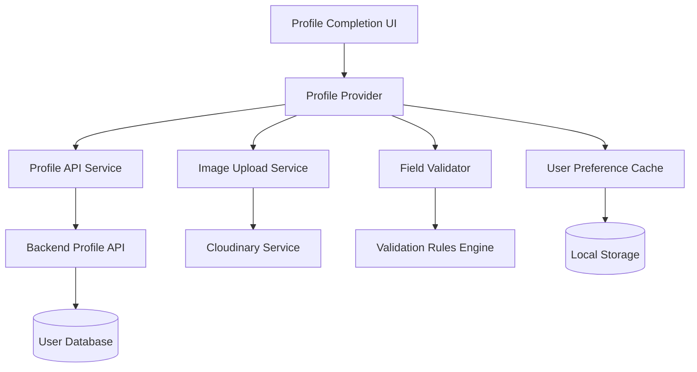
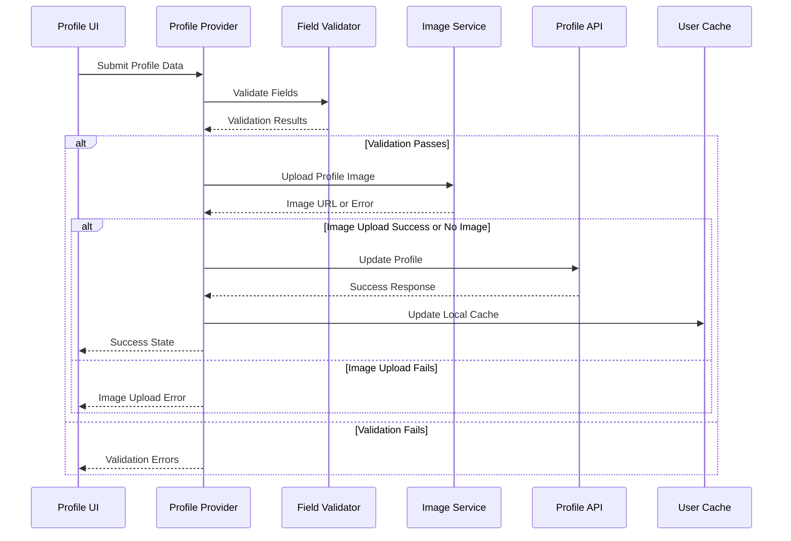

# Design Document

## Overview

This design document outlines the refactoring of the Complete Profile module to create a robust, error-resistant profile completion system that handles all user roles, validates data properly, and integrates seamlessly with backend services. The refactored system will provide a unified profile completion experience while maintaining role-specific field requirements.

## Architecture

### High-Level Architecture



### Component Interaction Flow



## Components and Interfaces

### 1. Profile Provider (Refactored)

**Purpose**: Centralized state management for profile completion across all user roles.

**Key Responsibilities**:
- Manage form state and validation
- Coordinate image uploads
- Handle API communication
- Update local cache
- Provide error handling and user feedback

**Interface**:
```dart
abstract class IProfileProvider {
  // State getters
  bool get isLoading;
  Map<String, String?> get fieldErrors;
  String? get errorMessage;
  bool get isFormValid;
  
  // Field setters with validation
  void setFirstName(String? value);
  void setLastName(String? value);
  void setPhone(String? value);
  void setPosition(String? value);
  void setJerseyNumber(String? value);
  void setEmergencyContactName(String? value);
  void setEmergencyPhone(String? value);
  void setExperience(String? value); // For referees
  
  // Image handling
  Future<void> pickImage();
  void setProfileImage(String? imagePath);
  
  // Form operations
  Future<bool> submitProfile();
  bool validateForm();
  void clearErrors();
  
  // Initialization and sync
  Future<void> initialize();
  Future<void> syncWithBackend();
}
```

### 2. Field Validator

**Purpose**: Centralized validation logic for all profile fields.

**Interface**:
```dart
class ProfileFieldValidator {
  static ValidationResult validateFirstName(String? value);
  static ValidationResult validateLastName(String? value);
  static ValidationResult validatePhone(String? value);
  static ValidationResult validatePosition(String? value);
  static ValidationResult validateJerseyNumber(String? value);
  static ValidationResult validateEmergencyContact(String? value);
  static ValidationResult validateEmergencyPhone(String? value);
  static ValidationResult validateExperience(String? value);
  
  static Map<String, String?> validateAllFields(
    Map<String, dynamic> fields,
    UserRole role,
  );
}

class ValidationResult {
  final bool isValid;
  final String? errorMessage;
  
  const ValidationResult({required this.isValid, this.errorMessage});
}
```

### 3. Enhanced Profile API Service

**Purpose**: Robust API communication with comprehensive error handling.

**Interface**:
```dart
class ProfileApiService {
  static Future<ProfileUpdateResult> updateProfile({
    required Map<String, dynamic> profileData,
    String? imageUrl,
  });
  
  static Future<UserProfileData?> fetchUserProfile();
  
  static Future<bool> checkPhoneUniqueness(String phone, String userId);
}

class ProfileUpdateResult {
  final bool success;
  final Map<String, dynamic>? userData;
  final ProfileUpdateError? error;
  
  const ProfileUpdateResult({
    required this.success,
    this.userData,
    this.error,
  });
}

enum ProfileUpdateError {
  unauthorized,
  userNotFound,
  duplicatePhone,
  imageUploadFailed,
  serverError,
  networkError,
}
```

### 4. Image Upload Service (Enhanced)

**Purpose**: Reliable image upload with proper error handling and retry logic.

**Interface**:
```dart
class ImageUploadService {
  static Future<ImageUploadResult> uploadProfileImage(File imageFile);
  
  static Future<ImageUploadResult> uploadWithRetry(
    File imageFile, {
    int maxRetries = 3,
  });
}

class ImageUploadResult {
  final bool success;
  final String? imageUrl;
  final String? errorMessage;
  
  const ImageUploadResult({
    required this.success,
    this.imageUrl,
    this.errorMessage,
  });
}
```

## Data Models

### Enhanced User Profile Data Model

```dart
class UserProfileData {
  final String id;
  final String? firstName;
  final String? lastName;
  final String? email;
  final String? phone;
  final String? position;
  final int? jerseyNumber;
  final String? emergencyContactName;
  final String? emergencyPhone;
  final String? experience; // For referees
  final String? profileImage;
  final bool profileCompleted;
  final UserRole role;
  final DateTime? lastUpdated;
  
  const UserProfileData({
    required this.id,
    this.firstName,
    this.lastName,
    this.email,
    this.phone,
    this.position,
    this.jerseyNumber,
    this.emergencyContactName,
    this.emergencyPhone,
    this.experience,
    this.profileImage,
    required this.profileCompleted,
    required this.role,
    this.lastUpdated,
  });
  
  factory UserProfileData.fromJson(Map<String, dynamic> json);
  Map<String, dynamic> toJson();
  
  UserProfileData copyWith({...});
}
```

### Role-Specific Field Requirements

```dart
class ProfileFieldRequirements {
  static const Map<UserRole, List<String>> requiredFields = {
    UserRole.captain: [
      'firstName',
      'lastName',
      'position',
      'emergencyContactName',
      'emergencyPhone',
    ],
    UserRole.player: [
      'firstName',
      'lastName',
      'position',
      'emergencyContactName',
      'emergencyPhone',
    ],
    UserRole.referee: [
      'firstName',
      'lastName',
      'experience',
      'emergencyContactName',
      'emergencyPhone',
    ],
    UserRole.freeAgent: [
      'firstName',
      'lastName',
      'position',
      'emergencyContactName',
      'emergencyPhone',
    ],
  };
  
  static const Map<UserRole, List<String>> optionalFields = {
    UserRole.captain: ['profileImage', 'phone'],
    UserRole.player: ['profileImage', 'phone', 'jerseyNumber'],
    UserRole.referee: ['profileImage', 'phone'],
    UserRole.freeAgent: ['profileImage', 'phone', 'jerseyNumber'],
  };
}
```

## Error Handling

### Error Classification and Handling Strategy

```dart
enum ProfileError {
  // Validation errors
  invalidFirstName,
  invalidLastName,
  invalidPhone,
  invalidPosition,
  invalidJerseyNumber,
  invalidEmergencyContact,
  invalidEmergencyPhone,
  invalidExperience,
  
  // API errors
  unauthorized,
  userNotFound,
  duplicatePhone,
  serverError,
  networkError,
  
  // Image upload errors
  imageUploadFailed,
  imageFileTooLarge,
  invalidImageFormat,
  
  // General errors
  unknownError,
}

class ProfileErrorHandler {
  static String getErrorMessage(ProfileError error) {
    switch (error) {
      case ProfileError.invalidFirstName:
        return 'First name is required and must be at least 2 characters';
      case ProfileError.invalidLastName:
        return 'Last name is required and must be at least 2 characters';
      case ProfileError.duplicatePhone:
        return 'This phone number is already registered to another user';
      case ProfileError.imageUploadFailed:
        return 'Failed to upload profile image. Please try again.';
      case ProfileError.networkError:
        return 'Network error. Please check your connection and try again.';
      // ... other error messages
    }
  }
  
  static ProfileError mapApiError(int statusCode, String? errorType) {
    switch (statusCode) {
      case 401:
        return ProfileError.unauthorized;
      case 404:
        return ProfileError.userNotFound;
      case 409:
        return ProfileError.duplicatePhone;
      case 500:
        return ProfileError.serverError;
      default:
        return ProfileError.unknownError;
    }
  }
}
```

## Testing Strategy

### Unit Testing Approach

**Profile Provider Tests**:
- Field validation logic
- State management
- Error handling
- Cache synchronization

**API Service Tests**:
- Request/response handling
- Error mapping
- Retry logic
- Authentication handling

**Validator Tests**:
- Field validation rules
- Role-specific requirements
- Edge cases and boundary conditions

**Image Upload Tests**:
- Upload success scenarios
- Upload failure handling
- Retry logic
- File validation

### Integration Testing

**End-to-End Profile Completion**:
- Complete profile flow for each user role
- Image upload integration
- Backend synchronization
- Error recovery scenarios

**Cross-Role Compatibility**:
- Ensure profile completion works for all roles
- Verify role-specific field handling
- Test role transitions if applicable

## Correctness Properties

*A property is a characteristic or behavior that should hold true across all valid executions of a system-essentially, a formal statement about what the system should do. Properties serve as the bridge between human-readable specifications and machine-verifiable correctness guarantees.*

### Property 1: Authentication Header Inclusion
*For any* profile update request, the request should include a valid Authorization Bearer token in the headers
**Validates: Requirements 1.1**

### Property 2: Field Whitespace Trimming
*For any* firstName or lastName field provided, the system should trim whitespace before including it in the request payload when the trimmed value is not empty
**Validates: Requirements 2.1**

### Property 3: Profile Field Inclusion
*For any* profile update request where position, jerseyNumber, emergencyContactName, or emergencyPhone are provided, these fields should be included in the request payload
**Validates: Requirements 2.5**

### Property 4: Graceful Null/Empty Field Handling
*For any* profile field that is undefined, null, or empty, the system should handle it gracefully without crashing or sending invalid data
**Validates: Requirements 2.6**

### Property 5: Partial Update Support
*For any* profile update request, the system should successfully send requests with only a subset of profile fields populated
**Validates: Requirements 2.7**

### Property 6: Image Upload Service Integration
*For any* profile image selection, the system should call the image upload service
**Validates: Requirements 3.1**

### Property 7: Image URL Inclusion After Upload
*For any* successful image upload, the returned image URL should be included in the subsequent profile update request
**Validates: Requirements 3.2**

### Property 8: Profile Updates Without Images
*For any* profile update request where no image is provided, the system should process other fields successfully
**Validates: Requirements 3.4**

### Property 9: Image Upload Error Handling
*For any* image upload error, the system should display appropriate error messages to the user
**Validates: Requirements 3.5**

### Property 10: Profile Completion Flag Setting
*For any* successful profile update, the profileCompleted flag should be set to true in the local cache
**Validates: Requirements 4.1**

### Property 11: Conditional Profile Completion
*For any* profile update where critical operations fail, the profileCompleted flag should not be set to true
**Validates: Requirements 4.2, 4.3**

### Property 12: Cache Update on Completion
*For any* successful profile completion, the local user preferences cache should be updated with the new profileCompleted status
**Validates: Requirements 4.4**

### Property 13: HTTP Status Code Handling
*For any* API response with different HTTP status codes, the system should handle each status code appropriately with corresponding user feedback
**Validates: Requirements 5.2**

### Property 14: Successful Response Handling
*For any* successful profile update response (200 OK), all user fields should be updated in the local state
**Validates: Requirements 5.3**

### Property 15: Complete Response Data Handling
*For any* profile update response, the system should properly handle complete user profile data without missing or undefined fields
**Validates: Requirements 5.4**

### Property 16: Error Response User Feedback
*For any* error response from the API, the system should display user-friendly error messages
**Validates: Requirements 5.5**

### Property 17: Required Field Validation
*For any* form submission attempt, the system should prevent submission when required fields are missing or invalid
**Validates: Requirements 6.1**

### Property 18: Field-Specific Error Messages
*For any* validation failure, the system should display specific error messages for each invalid field
**Validates: Requirements 6.2**

### Property 19: Duplicate Submission Prevention
*For any* form submission in progress, the system should prevent additional form submissions until the current request completes
**Validates: Requirements 6.3**

### Property 20: Success State Management
*For any* successful profile update, the system should update the local cache and navigate to the appropriate screen
**Validates: Requirements 6.4**

### Property 21: Network Error Handling
*For any* network error during profile update, the system should display appropriate error messages and retry options
**Validates: Requirements 6.5**

### Property 22: Multi-Role Support
*For any* user role (Captain, Player, Referee, Free Agent), the profile completion system should work correctly
**Validates: Requirements 7.1**

### Property 23: Role-Specific Field Isolation
*For any* user role, the role-specific field handling should not interfere with other roles' profile completion
**Validates: Requirements 7.5**

### Property 24: Cache Synchronization on Success
*For any* successful profile update, the UserPreferenceProvider cache should be updated with the new values
**Validates: Requirements 8.1**

### Property 25: Initialization Backend Sync
*For any* profile provider initialization, the system should trigger backend synchronization
**Validates: Requirements 8.2**

### Property 26: Sync Failure Resilience
*For any* backend synchronization failure, the system should continue working with cached data without breaking
**Validates: Requirements 8.3**

### Property 27: Partial Response Handling
*For any* backend response with partial profile data, the system should not overwrite valid cached data with undefined values
**Validates: Requirements 8.4**

### Property 28: Role-Based Navigation
*For any* successful profile completion, the system should navigate to the correct screen based on user role and team status
**Validates: Requirements 8.5**

Now I'll use the prework tool to analyze the acceptance criteria for correctness properties.

<function_calls>
<invoke name="prework">
<parameter name="featureName">complete-profile-refactor